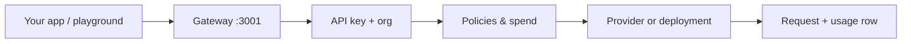

Every production call hits the **gateway** (Bun + Hono), not the Next.js dashboard. Default local URL: `http://localhost:3001`.

## 1. You send an OpenAI-shaped body

`POST /v1/chat/completions` with `Authorization: Bearer opd_…` (or the prefix your org issued). The playground does the same thing: it stores a real key named **Playground** in `localStorage` and streams from `${NEXT_PUBLIC_GATEWAY_URL}/v1/chat/completions`.

Other live routes on the same host:

- `POST /v1/completions`
- `POST /v1/embeddings`
- `POST /v1/rerank` (and `/v1/reranking`)
- `POST /v1/batches` plus `GET /v1/batches/:id`
- `GET /v1/models`
- `GET /health` and `GET /status`

## 2. The gateway authenticates the key

Auth middleware hashes the bearer token and looks up `api_keys` for your organization. Revoked keys and missing keys fail here. Restricted keys only see the model ids you ticked when you created them.

## 3. Policy and spend run before the model

Governance policies, rate limits (RPM/TPM), service tier (`standard` vs `priority`), and credit / plan spend are checked **before** a provider is called. A violation can 403; a spend cap can 402; load-shed on `standard` can 503.

## 4. A provider (or your GPU) answers

The `model` field is a catalog id (`qwen2.5-7b-instruct`, a vendor id, or `custom:<deployment-uuid>`). The gateway picks the matching provider adapter (Ollama, Together, DeepSeek, OpenAI, Anthropic, Azure Foundry, a Cloud Run URL, …) and forwards the body.

If you attached LoRAs on a dedicated deployment, that runtime is what answers — not a mock.

## 5. Usage is written

Prompt/completion tokens, latency, cost, and status land in `requests` (and roll up for the Usage page). Overview sparklines are the last 30 days of **your** org’s rows, not sample series.

## Where to watch it

| Surface | What you see |
|---------|----------------|
| Dashboard → Overview | 30-day request / token / spend / latency from `requests` |
| Dashboard → Usage | Daily series and per-model breakdown |
| Dashboard → Audit logs | Key create/revoke and admin actions |
| `GET /status` (and `/status` on the site) | Gateway, Postgres, Redis, configured providers |

Next: [Dashboard](/how-it-works/dashboard) or [Chat completions](/api-reference/chat-completions).
